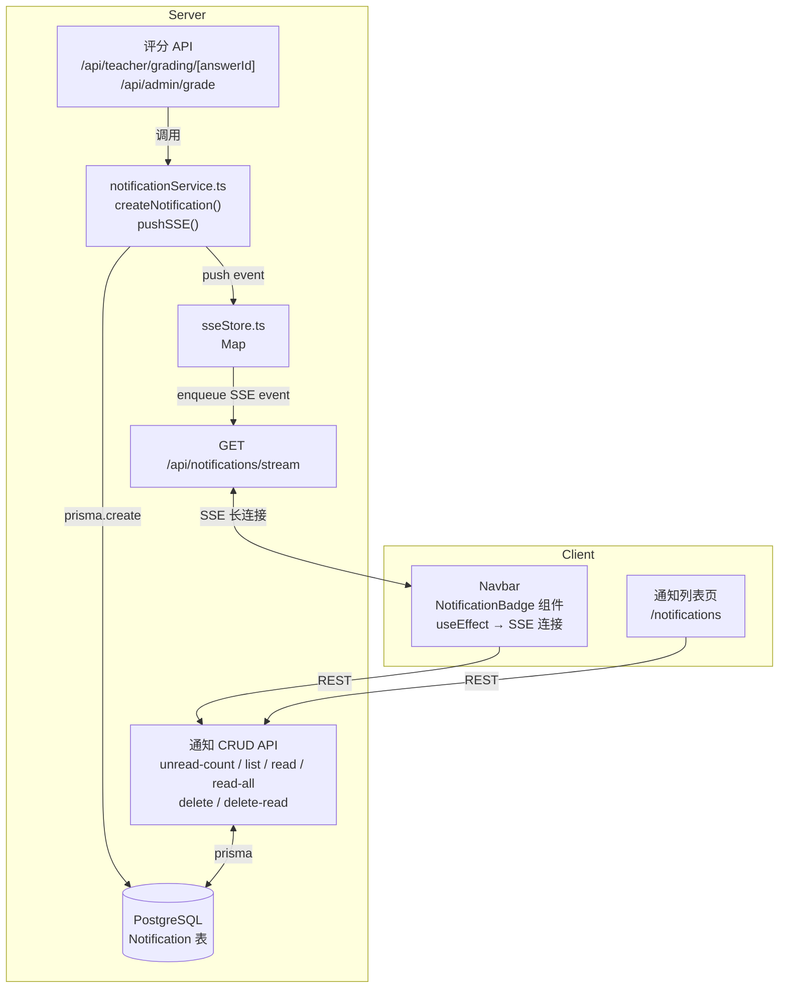

# Design Document: Notification System

## Overview

本设计为 Python 答题平台新增站内消息通知系统。核心流程：老师/管理员对编程题评分后，服务端在同一事务上下文中创建 `Notification` 记录，并通过 Server-Sent Events（SSE）实时推送给在线学生；学生可在导航栏角标感知未读数、在通知列表页浏览/标记/删除通知、点击跳转至对应答题记录详情。

技术栈：Next.js 14 App Router、Prisma ORM、PostgreSQL、NextAuth.js（JWT 策略）。

---

## Architecture



**关键设计决策：**

- SSE 连接状态存储在进程内存 `Map`（`sseStore.ts`）中，而非 Redis。适合单实例部署；若需多实例水平扩展，可替换为 Redis Pub/Sub，但当前规模无需此复杂度。
- 通知创建与评分操作在同一请求处理函数中顺序执行，通知失败不回滚评分（需求 1.10）。
- SSE 每条连接对应一个 `ReadableStreamDefaultController`，新连接建立时关闭旧连接（需求 9.10）。

---

## Components and Interfaces

### 1. `lib/notificationService.ts`

服务端工具模块，供评分 API 调用。

```typescript
export interface CreateNotificationInput {
  recipientId: string;
  sessionType: "exam" | "practice";
  sessionId: string;
  answerId: string;
  questionContent: string; // 原始内容，服务内截取前 100 字符
}

/**
 * 创建通知记录并推送 SSE 事件。
 * 失败时仅 console.error，不抛出异常。
 */
export async function createAndPushNotification(
  input: CreateNotificationInput
): Promise<void>
```

### 2. `lib/sseStore.ts`

进程内 SSE 连接注册表。

```typescript
type SSEController = ReadableStreamDefaultController<Uint8Array>;

// 每个 userId 最多一个活跃连接
const store = new Map<string, SSEController>();

export function registerSSE(userId: string, controller: SSEController): void
export function unregisterSSE(userId: string): void
export function pushSSE(userId: string, event: string, data: unknown): boolean
```

### 3. API Routes

| 方法 | 路径 | 说明 |
|------|------|------|
| GET | `/api/notifications/stream` | 建立 SSE 连接 |
| GET | `/api/notifications/unread-count` | 返回未读数 |
| GET | `/api/notifications` | 分页列表 |
| PATCH | `/api/notifications/[id]/read` | 标记单条已读 |
| PATCH | `/api/notifications/read-all` | 全部标记已读 |
| DELETE | `/api/notifications/[id]` | 删除单条 |
| DELETE | `/api/notifications/read` | 批量删除已读 |

### 4. 前端组件

**`components/NotificationBadge.tsx`**（嵌入 Navbar）

```typescript
// 仅 STUDENT 角色渲染
// useEffect: 建立 SSE 连接，监听 new-notification / notification-deleted 事件
// 初始化时 fetch /api/notifications/unread-count
// 对外暴露 unreadCount state
```

**`app/notifications/page.tsx`**

通知列表页，支持分页、标记已读、删除操作。

---

## Data Models

### Prisma Schema 新增

```prisma
model Notification {
  id              String   @id @default(cuid())
  recipientId     String
  sessionType     String   // "exam" | "practice"
  sessionId       String
  answerId        String
  questionContent String   // 最多 100 字符
  isRead          Boolean  @default(false)
  createdAt       DateTime @default(now())

  recipient User @relation(fields: [recipientId], references: [id], onDelete: Cascade)

  @@index([recipientId, isRead])
  @@index([recipientId, createdAt])
}
```

`User` 模型需新增反向关系字段：

```prisma
notifications Notification[]
```

### 索引说明

- `(recipientId, isRead)`：优化 `unread-count` 查询（`WHERE recipientId=? AND isRead=false`）
- `(recipientId, createdAt)`：优化分页列表查询（`WHERE recipientId=? ORDER BY createdAt DESC`）

### 通知 DTO（API 响应）

```typescript
interface NotificationDTO {
  id: string;
  sessionType: "exam" | "practice";
  sessionId: string;
  answerId: string;
  questionContent: string;
  isRead: boolean;
  createdAt: string; // ISO 8601
}

interface NotificationListResponse {
  items: NotificationDTO[];
  total: number;
  page: number;
  pageSize: number;
  totalPages: number;
}
```

---

## Correctness Properties

*A property is a characteristic or behavior that should hold true across all valid executions of a system — essentially, a formal statement about what the system should do. Properties serve as the bridge between human-readable specifications and machine-verifiable correctness guarantees.*

### Property 1: 评分后通知字段完整性

*For any* CODING 类型答题记录（exam 或 practice），当评分操作成功执行后，数据库中应存在一条 Notification 记录，且该记录的 `recipientId` 等于答题会话所属学生的 userId，`sessionType` 与会话类型一致，`sessionId` 等于会话 ID，`answerId` 等于答题记录 ID，`questionContent` 等于题目内容的前 100 字符，`isRead` 为 `false`。

**Validates: Requirements 1.1, 1.2, 1.3, 1.4, 1.5, 1.6, 1.7, 1.8**

### Property 2: 通知创建失败不中断评分

*For any* 评分请求，当 Notification 数据库写入抛出异常时，评分 API 仍应返回 HTTP 200 成功响应，且评分结果（isCorrect、comment、objectiveScore/correctCount）已正确持久化。

**Validates: Requirements 1.10**

### Property 3: 未读数准确性

*For any* 学生用户，其 `GET /api/notifications/unread-count` 返回的 `count` 值应精确等于数据库中 `recipientId = userId AND isRead = false` 的记录数量。

**Validates: Requirements 2.2**

### Property 4: 列表排序与分页一致性

*For any* 学生用户拥有 N 条通知，对任意合法的 `page` 和 `pageSize` 参数，列表 API 返回的 `items` 应按 `createdAt` 降序排列，`total` 等于 N，`totalPages` 等于 `ceil(N / pageSize)`，且 `items` 长度不超过 `pageSize`。

**Validates: Requirements 3.3, 3.4, 3.5**

### Property 5: 标记已读幂等性

*For any* 通知记录，对 `PATCH /api/notifications/[id]/read` 调用任意次数（≥1），结果均为该通知的 `isRead = true`，且 HTTP 响应均为 200。

**Validates: Requirements 4.5**

### Property 6: 通知跳转 URL 映射正确性

*For any* Notification，若 `sessionType = "exam"`，则生成的跳转 URL 应为 `/records/exam/[sessionId]`；若 `sessionType = "practice"`，则应为 `/records/practice/[sessionId]`。

**Validates: Requirements 5.1, 5.2**

### Property 7: 角标显示逻辑

*For any* 非负整数 `count`：若 `count = 0` 则角标不可见；若 `1 ≤ count ≤ 99` 则角标显示精确数字字符串；若 `count > 99` 则角标显示 `"99+"`。

**Validates: Requirements 6.2, 6.3, 6.4**

### Property 8: 通知数据隔离性

*For any* 两个不同的学生用户 A 和 B，用户 A 的认证凭据调用任何通知 API 端点，均不能返回、修改或删除 `recipientId = B.id` 的通知记录（应返回 HTTP 403 或空结果）。

**Validates: Requirements 8.1, 8.2**

### Property 9: 删除操作正确性

*For any* 通知记录，调用 `DELETE /api/notifications/[id]` 后，该记录不再出现在列表 API 的响应中。对于批量删除已读通知，`DELETE /api/notifications/read` 返回的 `deletedCount` 应精确等于执行前 `recipientId = userId AND isRead = true` 的记录数量。

**Validates: Requirements 10.2, 10.6**

---

## Error Handling

| 场景 | 处理方式 |
|------|----------|
| 通知创建 DB 失败 | `console.error` 记录，不抛出，评分正常返回 |
| SSE 推送目标不在线 | `sseStore.pushSSE` 返回 `false`，静默忽略 |
| SSE 连接被客户端关闭 | `req.signal` `abort` 事件触发 `unregisterSSE` + `clearInterval` |
| 新 SSE 连接替换旧连接 | `registerSSE` 先调用旧 controller 的 `close()`，再注册新连接 |
| 访问他人通知 | 返回 HTTP 403 |
| 通知不存在 | 返回 HTTP 404 |
| 未认证请求 | 返回 HTTP 401 |
| 非 STUDENT 角色访问通知端点 | 返回 HTTP 403 |
| `pageSize` 超过 50 | 强制截断为 50 |

---

## Testing Strategy

### 单元测试（example-based）

- `notificationService.createAndPushNotification`：验证字段截断（questionContent > 100 字符）、DB 失败时不抛出
- `sseStore`：注册/注销/推送逻辑、新连接替换旧连接
- 角标显示函数 `formatBadgeCount(n)`：边界值 0、1、99、100

### 属性测试（property-based）

使用 [fast-check](https://github.com/dubzzz/fast-check)，每个属性测试运行 **100 次**迭代。

**Property 1 — 评分后通知字段完整性**
```
Feature: notification-system, Property 1: 评分后通知字段完整性
```
生成随机 userId、sessionId、answerId、任意长度 questionContent，调用 `createAndPushNotification`，断言 DB 记录字段值。

**Property 2 — 通知创建失败不中断评分**
```
Feature: notification-system, Property 2: 通知创建失败不中断评分
```
Mock `prisma.notification.create` 抛出随机错误，调用评分处理函数，断言返回 `{ success: true }`。

**Property 3 — 未读数准确性**
```
Feature: notification-system, Property 3: 未读数准确性
```
生成随机数量的已读/未读通知，调用 `unread-count` handler，断言返回值等于未读数。

**Property 4 — 列表排序与分页一致性**
```
Feature: notification-system, Property 4: 列表排序与分页一致性
```
生成随机 N 条通知（随机 createdAt），随机 page/pageSize，断言排序和分页元数据。

**Property 5 — 标记已读幂等性**
```
Feature: notification-system, Property 5: 标记已读幂等性
```
生成随机通知（isRead 随机），调用 read handler 1~5 次，断言最终 isRead=true 且每次均返回 200。

**Property 6 — 通知跳转 URL 映射正确性**
```
Feature: notification-system, Property 6: 通知跳转 URL 映射正确性
```
生成随机 sessionType（"exam"|"practice"）和 sessionId，断言 `buildNotificationUrl` 纯函数输出。

**Property 7 — 角标显示逻辑**
```
Feature: notification-system, Property 7: 角标显示逻辑
```
生成随机非负整数，断言 `formatBadgeCount` 纯函数输出满足三段规则。

**Property 8 — 通知数据隔离性**
```
Feature: notification-system, Property 8: 通知数据隔离性
```
生成两个随机用户 A/B，为 B 创建通知，用 A 的 session 调用所有通知端点，断言均返回 403 或空列表。

**Property 9 — 删除操作正确性**
```
Feature: notification-system, Property 9: 删除操作正确性
```
生成随机通知集合，执行删除，断言列表中不再包含已删除项，批量删除返回正确 deletedCount。

### 集成测试

- SSE 心跳：验证 30 秒内收到 `: ping` 注释帧（1~2 次执行）
- SSE 连接替换：建立两个连接，验证第一个连接被关闭
- 评分 API 端到端：调用评分 → 验证通知记录存在 → 验证 SSE 事件推送
