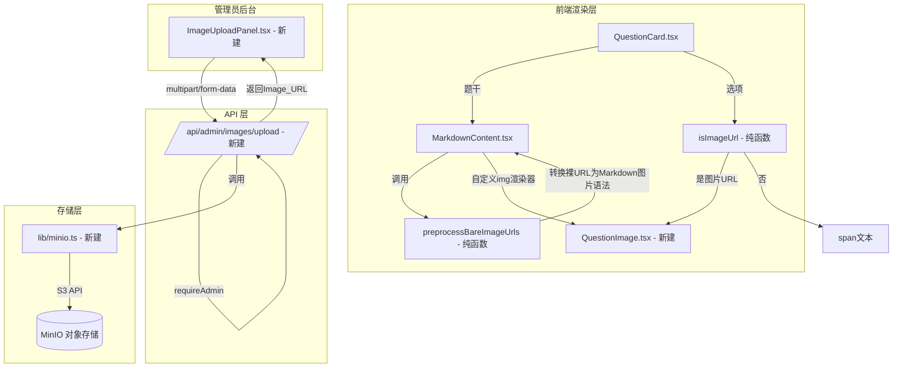

# Design Document: Question Image Support

## Overview

本功能为考试与练习系统添加图片渲染能力，使题干（content）和选项（optionA/B/C/D）中的裸图片 URL 能够自动识别并渲染为图片。图片托管于 MinIO 对象存储，管理员可通过后台面板批量上传图片并获取可直接嵌入题目的 URL。

**核心设计原则：**
- 零数据库改动：图片 URL 直接存储在现有的文本字段中，无需修改 Prisma schema
- 渐进增强：纯文本选项和题干保持原有渲染逻辑不变，仅对符合格式的裸 URL 做特殊处理
- 前端轻量：URL 识别逻辑为纯函数，便于测试和复用

---

## Architecture



**数据流说明：**

1. **题干渲染**：`QuestionCard` 将 `question.content` 传给 `MarkdownContent`，后者先调用 `preprocessBareImageUrls` 将裸 URL 转换为 `` 语法，再交给 `react-markdown` 渲染，自定义 `img` 渲染器使用 `QuestionImage` 组件
2. **选项渲染**：`QuestionCard` 对每个选项值调用 `isImageUrl`，返回 `true` 则渲染 `QuestionImage`，否则保持 `<span>` 文本渲染
3. **图片上传**：管理员在 `ImageUploadPanel` 选择文件，POST 到 `/api/admin/images/upload`，服务端通过 `lib/minio.ts` 上传至 MinIO，返回完整 URL

---

## Components and Interfaces

### 1. `lib/imageUtils.ts`（新建）

存放两个核心纯函数，供前端组件复用。

```typescript
/**
 * 判断字符串是否为裸图片 URL
 * 规则：以 http:// 或 https:// 开头，以图片扩展名结尾（忽略大小写）
 */
export function isImageUrl(value: string): boolean

/**
 * 将文本中的裸图片 URL 转换为 Markdown 图片语法
 * 例：将 "请看图 https://example.com/a.png 说明" 
 *     转换为 "请看图  说明"
 */
export function preprocessBareImageUrls(text: string): string
```

**正则表达式设计：**
```
/https?:\/\/[^\s]+\.(?:png|jpg|jpeg|gif|webp)/gi
```

- 匹配 `http://` 或 `https://` 开头
- 中间为非空白字符序列（贪婪匹配，自然在空白处截断）
- 以 `.png`、`.jpg`、`.jpeg`、`.gif`、`.webp` 结尾（大小写不敏感）

**`isImageUrl` 实现逻辑：**
```typescript
export function isImageUrl(value: string): boolean {
  return /^https?:\/\/[^\s]+\.(?:png|jpg|jpeg|gif|webp)$/i.test(value.trim())
}
```

**`preprocessBareImageUrls` 实现逻辑：**
```typescript
export function preprocessBareImageUrls(text: string): string {
  return text.replace(
    /https?:\/\/[^\s]+\.(?:png|jpg|jpeg|gif|webp)/gi,
    (url) => ``
  )
}
```

---

### 2. `components/QuestionImage.tsx`（新建）

处理图片加载状态和失败降级的通用组件。

```typescript
interface QuestionImageProps {
  src: string
  alt?: string
  className?: string
}
```

**状态机：**
```
loading（初始）→ loaded（onLoad 触发）
loading（初始）→ error（onError 触发）
```

**渲染逻辑：**
- `loading` 状态：显示骨架屏（`animate-pulse` 灰色矩形，`min-h-20`）
- `loaded` 状态：显示 ``，样式 `max-w-full h-auto`
- `error` 状态：显示 Fallback_Placeholder（图片图标 + "图片加载失败"文字，`min-h-20`）

---

### 3. `components/MarkdownContent.tsx`（修改）

**变更点：**

1. 在渲染前调用 `preprocessBareImageUrls(content)` 预处理内容
2. 新增 `img` 自定义渲染器，使用 `QuestionImage` 组件

```typescript
// 新增 img 渲染器
img({ src, alt }) {
  if (!src) return null
  return <QuestionImage src={src} alt={alt ?? "image"} className="my-2 rounded" />
}
```

**修改位置：**
```typescript
// 修改前
<ReactMarkdown remarkPlugins={[remarkGfm]} components={components}>
  {content}
</ReactMarkdown>

// 修改后
<ReactMarkdown remarkPlugins={[remarkGfm]} components={components}>
  {preprocessBareImageUrls(content)}
</ReactMarkdown>
```

---

### 4. `components/QuestionCard.tsx`（修改）

**变更点：** 选项渲染逻辑中，对 `text` 调用 `isImageUrl` 判断，决定渲染方式。

```typescript
// 修改前
<span className="flex-1">{text}</span>

// 修改后
<span className="flex-1">
  {isImageUrl(text)
    ? <QuestionImage src={text} alt={`选项 ${key}`} className="max-h-40 rounded" />
    : text
  }
</span>
```

---

### 5. `lib/minio.ts`（新建）

MinIO 客户端单例，使用 `minio` npm 包（S3 兼容 API）。

```typescript
import { Client } from "minio"

export function getMinioClient(): Client

export function buildImageUrl(
  endpoint: string,
  port: number,
  useSSL: boolean,
  bucket: string,
  folder: string,
  filename: string
): string
```

**`buildImageUrl` 输出格式：**
```
{protocol}://{endpoint}:{port}/{bucket}/{folder}/{filename}
```
其中 `protocol` 为 `useSSL ? "https" : "http"`。

**环境变量读取：**
```typescript
const endpoint  = process.env.MINIO_ENDPOINT!
const port      = parseInt(process.env.MINIO_PORT ?? "9000")
const accessKey = process.env.MINIO_ACCESS_KEY!
const secretKey = process.env.MINIO_SECRET_KEY!
const bucket    = process.env.MINIO_BUCKET!
const useSSL    = process.env.MINIO_USE_SSL !== "false"  // 默认 true
```

---

### 6. `app/api/admin/images/upload/route.ts`（新建）

**接口规范：**

| 属性 | 值 |
|------|-----|
| 方法 | `POST` |
| Content-Type | `multipart/form-data` |
| 认证 | 需要 ADMIN 角色（复用 `requireAdmin`） |
| 路径 | `/api/admin/images/upload` |

**请求字段（FormData）：**
- `files`：一个或多个图片文件（必填）
- `folder`：目标文件夹名称（可选，默认当天日期 `YYYY-MM-DD`）

**响应格式：**
```typescript
{
  results: Array<{
    filename: string
    url?: string      // 成功时有值
    error?: string    // 失败时有值
  }>
}
```

**处理流程：**
1. `requireAdmin(session)` — 鉴权，失败返回 403
2. 检查必需环境变量 — 缺失返回 500
3. 解析 `FormData`，获取 `files` 和 `folder`
4. 对每个文件：
   a. 检查文件大小 ≤ 10MB，超出记录错误，跳过
   b. 调用 `minioClient.putObject(bucket, objectName, stream, size, metadata)`
   c. 成功则调用 `buildImageUrl` 构建完整 URL
   d. 失败则记录错误原因
5. 返回 `results` 数组

**对象名称构建：**
```
{folder}/{filename}
```
其中 `filename` 为原始文件名（`file.name`），`folder` 默认为 `new Date().toISOString().slice(0, 10)`（`YYYY-MM-DD`）。

---

### 7. `app/admin/questions/ImageUploadPanel.tsx`（新建）

管理员后台图片上传面板，作为独立客户端组件，集成到 `BankManagerClient` 或作为独立页面标签页。

**UI 结构：**
```
┌─────────────────────────────────────────────┐
│  图片上传                                    │
│  ┌─────────────────────────────────────────┐│
│  │  文件夹名称（可选）  [YYYY-MM-DD]        ││
│  └─────────────────────────────────────────┘│
│  ┌─────────────────────────────────────────┐│
│  │  拖拽或点击选择图片文件                  ││
│  │  支持 JPEG、PNG、GIF、WebP，单文件 ≤10MB ││
│  └─────────────────────────────────────────┘│
│  [上传]                                      │
│                                              │
│  上传结果：                                  │
│  ✓ q1_optB.png  https://...  [复制]         │
│  ✗ large.png    文件超过 10MB               │
└─────────────────────────────────────────────┘
```

**状态定义：**
```typescript
type FileStatus = "pending" | "uploading" | "success" | "error"

interface FileItem {
  file: File
  status: FileStatus
  url?: string
  error?: string
}
```

**集成方式：** 在 `BankManagerClient.tsx` 的题库组详情区域新增"图片管理"标签页，或在 `app/admin/questions/page.tsx` 的页面顶部新增独立的图片上传区块。推荐后者，避免与题库组选择状态耦合。

---

## Data Models

本功能不修改数据库 schema。图片 URL 直接存储在 `Question` 模型的现有字段中：

```
Question.content    → 题干文本，可包含裸图片 URL
Question.optionA    → 选项，可为裸图片 URL 或普通文本
Question.optionB    → 同上
Question.optionC    → 同上
Question.optionD    → 同上
```

**MinIO 对象存储结构：**
```
{MINIO_BUCKET}/
  {YYYY-MM-DD}/          ← 默认按日期分文件夹
    image1.png
    image2.jpg
  custom-folder/         ← 管理员指定文件夹
    q1_optA.png
```

---

## Correctness Properties

*A property is a characteristic or behavior that should hold true across all valid executions of a system — essentially, a formal statement about what the system should do. Properties serve as the bridge between human-readable specifications and machine-verifiable correctness guarantees.*

本功能的核心逻辑集中在两个纯函数（`isImageUrl`、`preprocessBareImageUrls`）和一个 URL 构建函数（`buildImageUrl`）上，这些函数具有明确的输入输出关系，适合属性测试。

**Property Reflection（冗余消除）：**
- 需求 1.1 和 1.2 均关于 `preprocessBareImageUrls` 的行为，可合并为一个综合属性
- 需求 2.1 和 2.2 均关于 `isImageUrl` 的判断，可合并为一个综合属性
- 需求 6.1 和 6.2 均关于 `buildImageUrl` 的输出格式，可合并为一个综合属性

---

### Property 1: 裸 URL 预处理转换

*For any* 包含零个或多个裸图片 URL 的文本字符串，调用 `preprocessBareImageUrls` 后，原文本中每个裸图片 URL 都应被替换为 `` 格式，且非 URL 的文字部分保持不变。

**Validates: Requirements 1.1, 1.2**

---

### Property 2: 图片 URL 识别的完备性与精确性

*For any* 字符串，`isImageUrl` 的返回值应满足：当且仅当该字符串整体是以 `http://` 或 `https://` 开头、以 `.png`/`.jpg`/`.jpeg`/`.gif`/`.webp` 结尾的 URL 时返回 `true`，否则返回 `false`。

**Validates: Requirements 2.1, 2.2**

---

### Property 3: 图片 URL 构建格式一致性

*For any* 合法的 endpoint、port、bucket、folder、filename 组合，`buildImageUrl` 返回的字符串应满足：以正确协议开头（`https://` 或 `http://`），包含 endpoint、port、bucket、folder、filename，且 filename 与输入完全一致（原样保留）。

**Validates: Requirements 6.1, 6.2**

---

## Error Handling

### 前端错误处理

| 场景 | 处理方式 |
|------|---------|
| 图片加载失败（网络错误、404 等） | `QuestionImage` 捕获 `onError`，切换到 Fallback_Placeholder 状态 |
| 图片加载中 | 显示骨架屏动画，避免布局跳动 |
| 选项值为空字符串 | `isImageUrl("")` 返回 `false`，保持原有文本渲染 |
| 题干为空字符串 | `preprocessBareImageUrls("")` 返回空字符串，`react-markdown` 正常处理 |

### 后端错误处理

| 场景 | HTTP 状态码 | 响应 |
|------|------------|------|
| 未登录 | 401 | `{ error: "Unauthorized" }` |
| 非 ADMIN 角色 | 403 | `{ error: "Forbidden" }` |
| 必需环境变量缺失 | 500 | `{ error: "MinIO configuration missing: MINIO_ENDPOINT" }` |
| 单文件超过 10MB | 400（记录在 results 中） | `{ results: [{ filename, error: "文件大小超过 10MB 限制" }] }` |
| MinIO 上传失败 | 200（记录在 results 中） | `{ results: [{ filename, error: "上传失败: ..." }] }` |
| 请求体解析失败 | 400 | `{ error: "Invalid form data" }` |

**部分失败策略：** 批量上传时，单个文件失败不影响其他文件，所有结果统一在 `results` 数组中返回，HTTP 状态码始终为 200（除非整体请求无效）。

---

## Testing Strategy

### 单元测试（Jest）

**`lib/imageUtils.test.ts`：**
- `isImageUrl`：具体示例测试（有效 URL、无效 URL、边界情况）
- `preprocessBareImageUrls`：具体示例测试（纯文本、纯 URL、混合内容、多个 URL）

**`lib/minio.test.ts`：**
- `buildImageUrl`：具体示例测试（SSL/非 SSL、不同端口、特殊文件名）
- 缺少环境变量时的错误处理

**`components/QuestionImage.test.tsx`（React Testing Library）：**
- 初始渲染显示骨架屏
- `onLoad` 后显示图片，隐藏骨架屏
- `onError` 后显示 Fallback_Placeholder，包含"图片加载失败"文字
- Fallback_Placeholder 有 `min-h-20` 样式类

### 属性测试（fast-check，已在项目中）

项目已安装 `fast-check@^3.23.2`，直接使用。每个属性测试运行 **100 次**迭代。

**`lib/imageUtils.property.test.ts`：**

```typescript
// Feature: question-image-support, Property 1: 裸 URL 预处理转换
it("preprocessBareImageUrls: 所有裸图片 URL 被转换，非 URL 文字不变", () => {
  fc.assert(fc.property(
    fc.array(fc.oneof(
      fc.constant("普通文字"),
      fc.constantFrom(
        "https://example.com/img.png",
        "http://host:9000/bucket/folder/img.jpg"
      )
    )),
    (parts) => {
      const input = parts.join(" ")
      const output = preprocessBareImageUrls(input)
      // 所有裸 URL 都被转换
      const urls = parts.filter(p => isImageUrl(p))
      for (const url of urls) {
        expect(output).toContain(``)
        expect(output).not.toMatch(new RegExp(`(?<!\\()${url.replace(/[.*+?^${}()|[\]\\]/g, '\\$&')}(?!\\))`))
      }
    }
  ), { numRuns: 100 })
})

// Feature: question-image-support, Property 2: 图片 URL 识别的完备性与精确性
it("isImageUrl: 正确识别图片 URL，拒绝非图片 URL", () => {
  fc.assert(fc.property(
    fc.oneof(
      // 有效图片 URL
      fc.tuple(
        fc.constantFrom("http", "https"),
        fc.domain(),
        fc.constantFrom(".png", ".jpg", ".jpeg", ".gif", ".webp")
      ).map(([proto, domain, ext]) => ({ url: `${proto}://${domain}/img${ext}`, expected: true })),
      // 无效：非图片扩展名
      fc.tuple(
        fc.constantFrom("http", "https"),
        fc.domain()
      ).map(([proto, domain]) => ({ url: `${proto}://${domain}/file.txt`, expected: false })),
      // 无效：纯文本
      fc.string({ minLength: 1 }).filter(s => !s.startsWith("http")).map(s => ({ url: s, expected: false }))
    ),
    ({ url, expected }) => {
      expect(isImageUrl(url)).toBe(expected)
    }
  ), { numRuns: 100 })
})

// Feature: question-image-support, Property 3: 图片 URL 构建格式一致性
it("buildImageUrl: 输出格式正确且文件名原样保留", () => {
  fc.assert(fc.property(
    fc.record({
      endpoint: fc.domain(),
      port: fc.integer({ min: 1, max: 65535 }),
      useSSL: fc.boolean(),
      bucket: fc.stringMatching(/^[a-z0-9-]{3,20}$/),
      folder: fc.stringMatching(/^[a-z0-9-]{1,20}$/),
      filename: fc.stringMatching(/^[a-zA-Z0-9_-]+\.(png|jpg|jpeg|gif|webp)$/)
    }),
    ({ endpoint, port, useSSL, bucket, folder, filename }) => {
      const url = buildImageUrl(endpoint, port, useSSL, bucket, folder, filename)
      const protocol = useSSL ? "https" : "http"
      expect(url).toBe(`${protocol}://${endpoint}:${port}/${bucket}/${folder}/${filename}`)
      expect(url).toContain(filename)  // 文件名原样保留
    }
  ), { numRuns: 100 })
})
```

### 集成测试

**`app/api/admin/images/upload/route.test.ts`（mock MinIO）：**
- 鉴权：未登录返回 401，非 ADMIN 返回 403
- 环境变量缺失返回 500
- 文件超过 10MB 在 results 中标记错误
- 上传成功返回正确格式的 URL
- 部分失败时其他文件不受影响

### 手动测试清单

- [ ] 题干中包含裸 URL 时，图片正确渲染
- [ ] 题干中混合文字和 URL 时，排版正确
- [ ] 选项为图片 URL 时，图片在选项按钮内正确显示，不超出边界
- [ ] 图片加载失败时，显示"图片加载失败"占位符
- [ ] 图片加载中，骨架屏动画正常显示
- [ ] 管理员上传面板：多文件选择、进度状态、URL 复制功能
- [ ] 非 ADMIN 用户无法访问上传接口
